# Phase-Wise Architecture: Mutual Fund FAQ Assistant

## Overview
This document outlines the detailed phase-wise architecture for building a facts-only Mutual Fund FAQ Assistant using Retrieval-Augmented Generation (RAG) approach. The system will provide accurate, source-backed responses to factual queries about mutual fund schemes while strictly avoiding investment advice.

## High-Level System Architecture

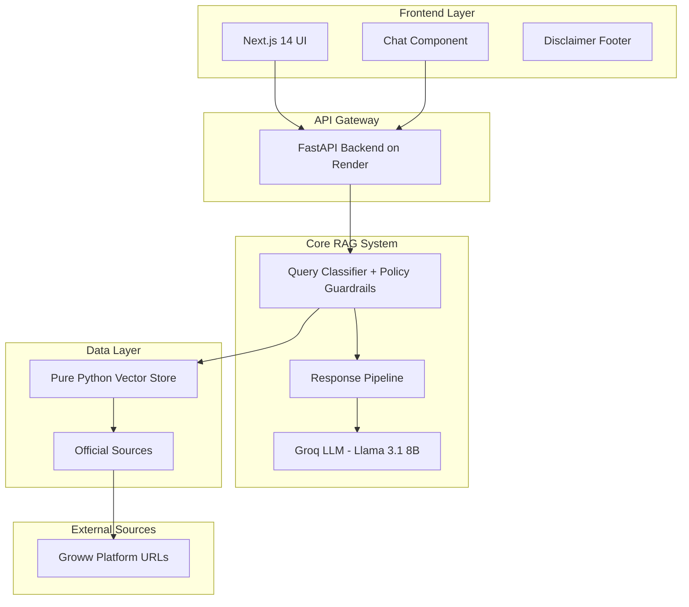

## Phase 1: Foundation Setup and Data Collection

### 1.1 Infrastructure Setup
- **Backend Framework**: FastAPI (Python 3.11+)
- **Frontend Framework**: Next.js 14 with TypeScript
- **Vector Database**: Pure Python VectorStore (JSON persistence, cosine similarity)
- **LLM Integration**: Groq (Llama 3.1 8B Instant)
- **Embeddings**: Lightweight hash-based bag-of-words (384 dimensions)
- **Deployment**: Render (backend), Vercel (frontend), GitHub Actions (CI/CD)

### 1.2 Corpus Definition and Collection
**Selected AMC**: HDFC Mutual Fund
**Selected Schemes** (from Groww platform):
- HDFC Large Cap Fund Direct Growth
- HDFC Equity Fund Direct Growth
- HDFC Focused Fund Direct Growth
- HDFC ELSS Tax Saver Fund Direct Plan Growth
- HDFC Mid Cap Fund Direct Growth

**Data Sources** (Exclusive - Only these URLs):
1. **Groww Mutual Fund Pages** (5 URLs)
   - https://groww.in/mutual-funds/hdfc-mid-cap-fund-direct-growth
   - https://groww.in/mutual-funds/hdfc-equity-fund-direct-growth
   - https://groww.in/mutual-funds/hdfc-focused-fund-direct-growth
   - https://groww.in/mutual-funds/hdfc-elss-tax-saver-fund-direct-plan-growth
   - https://groww.in/mutual-funds/hdfc-large-cap-fund-direct-growth

**Data Extraction Scope**:
- Fund factsheets and performance data
- Expense ratios and exit loads
- Minimum SIP amounts and investment details
- Riskometer classifications and benchmark indices
- Scheme information documents (if linked from Groww pages)
- Tax-related information for ELSS funds
- Asset allocation and portfolio details

**Important Constraint**: The RAG system will ONLY use data extracted from these 5 specific Groww URLs. No external sources, AMC websites, AMFI, or SEBI data will be used to ensure data consistency and compliance with the requirement.

### 1.3 Data Processing Pipeline

#### 1.3.1 Web Scraping Implementation
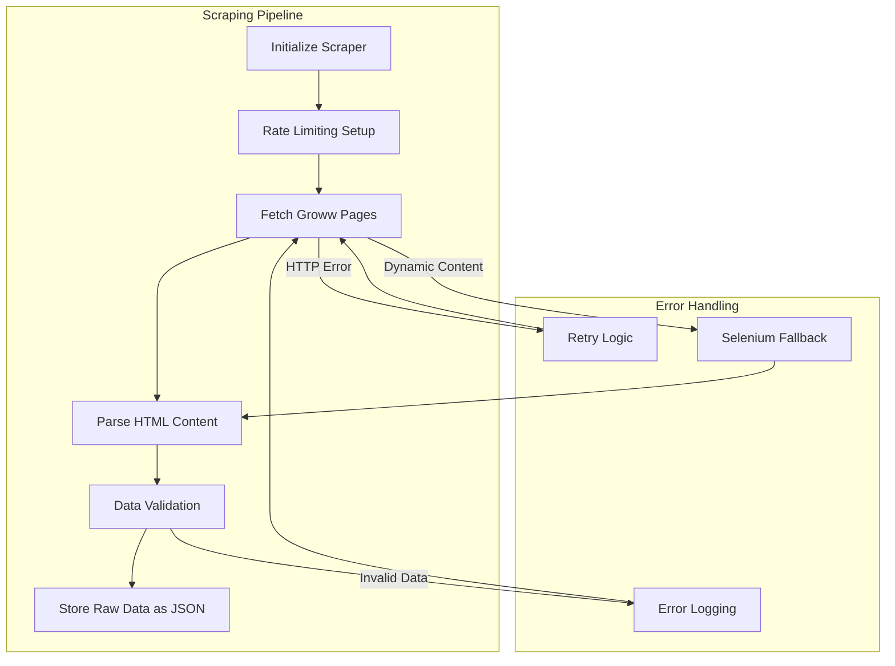

**Implementation Details**:
- **Rate Limiting**: 2-second delays between requests
- **User-Agent Rotation**: Multiple browser signatures
- **Selenium Fallback**: For dynamic content loading
- **Data Validation**: Schema validation for each fund
- **Error Recovery**: 3 retry attempts with exponential backoff
- **Source URLs**: Only the 5 specified Groww mutual fund URLs

#### 1.3.2 Data Cleaning and Preprocessing
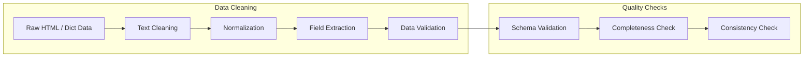

**Processing Steps**:
- **HTML Cleaning**: Remove scripts, styles, and navigation elements
- **Text Normalization**: Unicode normalization and whitespace handling
- **Field Extraction**: Structured data extraction for fund details
- **Schema Validation**: Ensure all required fields are present
- **Data Type Conversion**: Convert strings to appropriate data types
- **Missing Value Handling**: Standardize "Not available" values

#### 1.3.3 Text Chunking Strategy
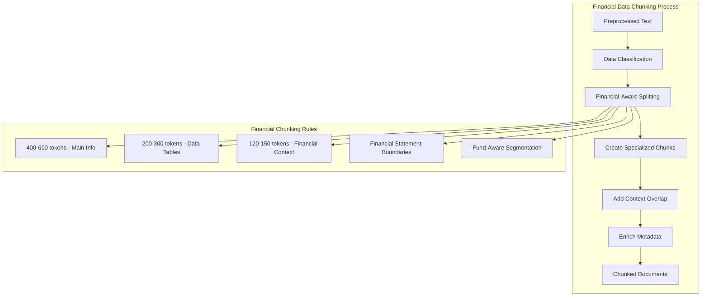

**Financial Data-Specific Chunking Strategy**:

**Chunk Types for Mutual Fund Data**:
- **Primary Chunks**: 400-600 tokens for main fund information (name, type, category, basic metrics)
- **Metric Chunks**: 200-300 tokens for specific data tables (returns, asset allocation, risk metrics)
- **Overview Chunks**: 300-400 tokens for fund descriptions and investment objectives
- **Performance Chunks**: 250-350 tokens for historical performance data and comparisons

**Financial-Aware Splitting Rules**:
- **Token Range**: 200-600 tokens per chunk (smaller than generic for financial precision)
- **Overlap**: 120-150 tokens between chunks for financial context preservation
- **Financial Boundaries**: Preserve complete financial statements and metric tables
- **Fund Category Awareness**: Different chunking for equity vs debt funds
- **Data Structure Preservation**: Keep related financial metrics together

**Metadata Enrichment**:
- **Fund Metadata**: Name, category, risk level, AUM size
- **Chunk Type**: Primary, metric, overview, performance
- **Financial Context**: Investment objective, benchmark comparison
- **Source Tracking**: Original URL, extraction timestamp, data freshness
- **Quality Indicators**: Completeness score, confidence level

**Specialized Processing**:
- **Table Chunking**: Dedicated chunks for returns tables and asset allocation
- **Hierarchical Chunking**: Fund overview → detailed metrics → historical data
- **Cross-Reference Chunks**: Links to related funds and benchmark data
- **Time-Based Chunking**: Historical performance data with temporal context

**Quality Metrics for Financial Data**:
- **Financial Completeness**: All required metrics present in chunks
- **Context Preservation**: Financial relationships maintained between chunks
- **Retrieval Relevance**: Optimized for mutual fund queries
- **Data Freshness**: Track age of financial information in chunks

#### 1.3.4 Embedding Generation
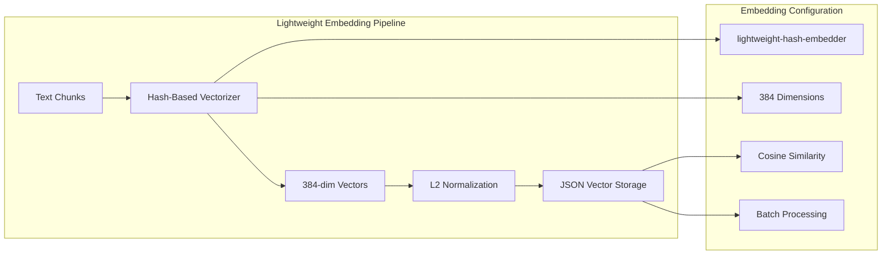

**Lightweight Hash-Based Embedding**:

**Model Selection**:
- **lightweight-hash-embedder**: Pure Python hash-based bag-of-words vectorizer
- **384 Dimensions**: Fixed-dimension vectors matching standard embedding size
- **Hashed Bag-of-Words**: Words mapped to vector indices via MD5 hashing
- **L2 Normalization**: Unit-length vectors for consistent cosine similarity

**Embedding Pipeline**:
- **Text Preprocessing**: Lowercase, remove non-alphanumeric characters
- **Word Frequency**: Log-scaled word counts for balanced term weighting
- **Hash Mapping**: MD5 hash of each word determines vector index (mod 384)
- **Batch Processing**: Efficient processing of multiple chunks per batch
- **Zero Dependencies**: No PyTorch, SentenceTransformers, or HuggingFace Hub required

**Why This Approach**:
- **CI/CD Friendly**: Runs in GitHub Actions without GPU or large model downloads
- **No Native Code Crashes**: Avoids ChromaDB and ONNX compatibility issues
- **Fast**: ~1ms per chunk embedding generation
- **Deterministic**: Same text always produces the same vector

#### 1.3.5 Vector Database Integration
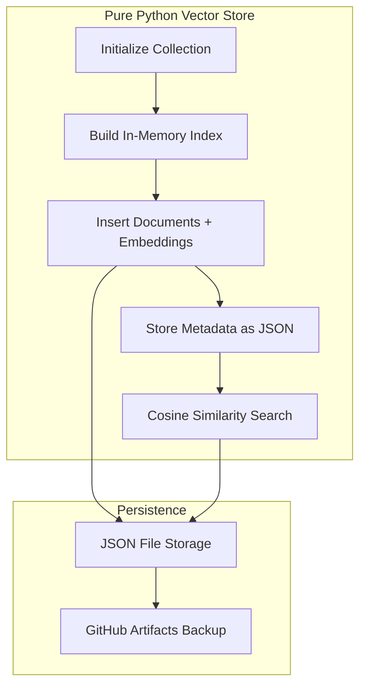

**Database Features**:
- **Pure Python Implementation**: No native dependencies (no ONNX, no chromadb binary)
- **JSON Persistence**: Data stored in `vector_store/store.json`
- **Cosine Similarity**: Brute-force similarity search with distance metric
- **Metadata Storage**: Fund name, chunk type, source URL per document
- **Drop-in Replacement**: `VectorStore` class wraps `VectorCollection` with same API as ChromaDB

**Overall Pipeline Components**:
- **Web Scraper**: BeautifulSoup + Selenium for Groww URLs
- **Document Parser**: HTML processing with field extraction
- **Text Chunker**: Semantic chunking with context preservation
- **Embedding Model**: Hash-based bag-of-words vectorizer (384-dim)
- **Vector Store**: Pure Python JSON store with cosine similarity search

### 1.4 Automated Data Scheduling

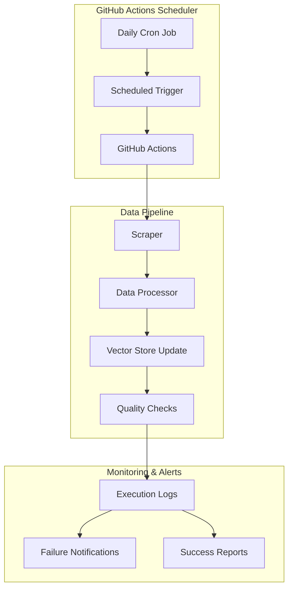

**GitHub Actions Workflow Configuration**:
- **Schedule**: Daily execution at 2:00 AM UTC (off-peak hours)
- **Environment**: Ubuntu runner with Python dependencies
- **Triggers**: 
  - Scheduled cron job (daily)
  - Manual dispatch for on-demand updates
  - Webhook for emergency updates

**Workflow Steps**:
1. **Environment Setup**: Spin up container with scraping dependencies
2. **Data Collection**: Scrape all 5 Groww URLs with rate limiting
3. **Data Processing**: Clean, chunk, and generate embeddings
4. **Vector Store Update**: Update JSON vector store with new data
5. **Quality Validation**: Verify data integrity and completeness
6. **Backup**: Create backup of vector database
7. **Notification**: Send success/failure alerts

**Error Handling**:
- **Retry Logic**: 3 retry attempts with exponential backoff
- **Failure Notifications**: Email/Slack alerts on workflow failure
- **Rollback**: Automatic rollback to previous working dataset
- **Manual Override**: Manual trigger for emergency updates

**Monitoring and Logging**:
- **Execution Logs**: Detailed logging of each workflow step
- **Performance Metrics**: Track scraping duration and success rates
- **Data Quality Metrics**: Monitor data completeness and accuracy
- **Storage Monitoring**: Track vector database size and health

**Configuration Files**:
```yaml
# .github/workflows/data-scraping.yml
name: Daily Data Scraping
on:
  schedule:
    - cron: '0 2 * * *'  # Daily at 2:00 AM UTC
  workflow_dispatch:  # Manual trigger
```

**Environment Variables**:
- `GROWW_BASE_URL`: Base URL for Groww mutual fund pages
- `GROQ_API_KEY`: Groq LLM API key for response generation
- `PIPELINE_MIN_FUNDS`: Minimum funds required for validation
- `PIPELINE_MIN_DOCUMENT_COUNT`: Minimum documents in vector store
- `NOTIFICATION_WEBHOOK`: Alert notification endpoint

## Phase 2: Core RAG System Development

### 2.1 Retrieval System Architecture

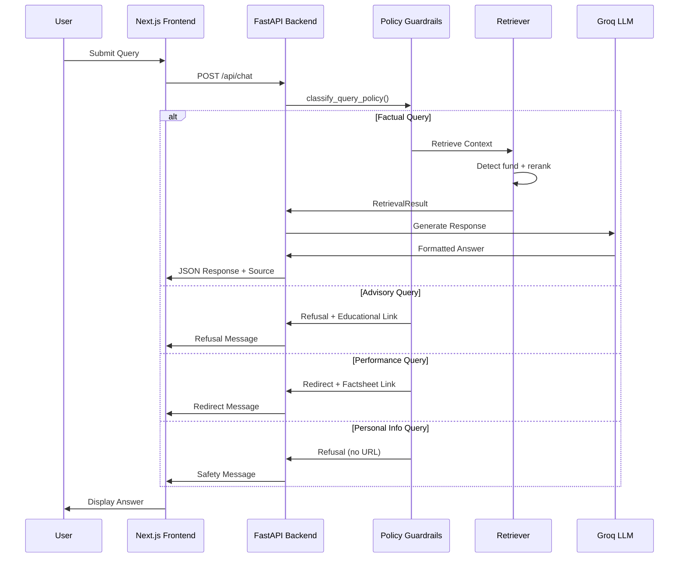

**Key Components**:
- **Policy Guardrails** (`classify_query_policy`): Regex-based classifier that categorizes queries into `factual`, `advisory`, `performance`, or `personal_info` before any retrieval occurs.
- **Query Preprocessor**: Normalizes query, detects fund name + metric intent (expense ratio, exit load, SIP, NAV, risk, benchmark, holdings, sector allocation).
- **Query Embedding**: Embeds the query using the **same hash-based vectorizer as the corpus** (`_text_to_vector`, 384-dim) to stay in the same vector space.
- **Vector Search**: Retrieve top-k candidates (k=30) using cosine similarity against stored embeddings in `VectorCollection`.
- **Out-of-Scope Detection**: Regex patterns detect queries about funds not in the corpus (e.g., Axis, SBI, ICICI, Parag Parikh) and return early.
- **Metadata-Aware Reranking**:
  - If a fund name is detected, **filter** chunks to only matching `fund_name` metadata.
  - If a metric intent is detected, **boost** matching `chunk_type` scores.
  - Weighted score: vector similarity (75%) + lexical overlap (20%) + metadata boost (5%).
- **Lexical Fallback**: If vector search fails, falls back to loading chunked JSON files and scoring via keyword overlap.
- **Context Assembler**: Caps at top 6 chunks, preserves `source_url` for citations.

**Why this strategy fits our current data**:
- The corpus is small (5 Groww pages) but highly structured into financial chunk types; **metadata-aware reranking** improves precision without heavy infrastructure.
- Since the vector store uses **precomputed hash-based embeddings**, embedding the query with the same `_text_to_vector` function avoids mismatch.
- **Lexical fallback** ensures retrieval works even when the vector store is empty or the query doesn't match semantically.

**Retrieval Defaults (tunable)**:
- **Candidate fetch**: k=30 then rerank → keep top n=6
- **Fund routing**: if fund detected, filter to only chunks matching that `fund_name`
- **Context sufficiency**: cosine similarity >= 0.35 (vector mode) or lexical overlap >= 0.10 (fallback mode)
- **Chunk boosts**:
  - metric-intent → boost `chunk_type=metric`
  - risk/benchmark-intent → boost `chunk_type=primary`
  - performance-intent → boost `chunk_type=performance` (but policy guardrails may redirect)

### 2.2 Query Classification System

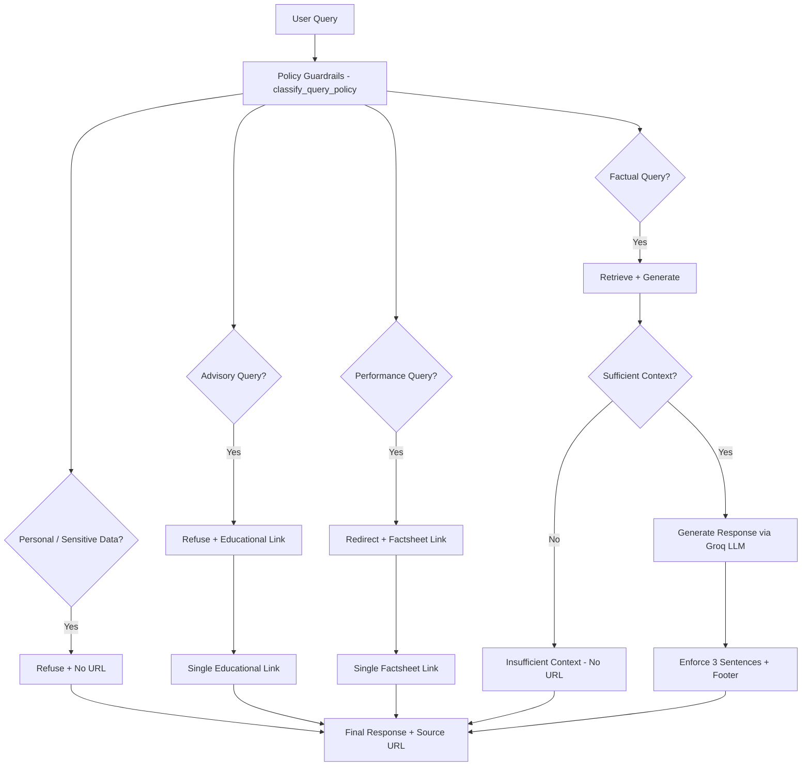

**Categories**:
1. **Factual Queries** (Allowed)
   - Expense ratio, exit load, minimum SIP
   - Lock-in periods, riskometer, benchmark
   - Document download processes

2. **Advisory Queries** (Blocked)
   - Investment recommendations
   - Performance comparisons
   - "Should I invest?" type questions

3. **Performance Queries** (Redirect)
   - Return calculations → Link to factsheet
   - Historical performance → Link to official documents

4. **Personal/Sensitive Information Queries** (Blocked)
   - PAN/Aadhaar numbers
   - Account numbers
   - OTPs
   - Email addresses or phone numbers

**Regex-Based Policy** (`guardrails/policy.py`):
- **ADVISORY_PATTERNS**: "should i invest", "recommend", "best fund", etc.
- **PERFORMANCE_PATTERNS**: "returns", "CAGR", "outperform", etc.
- **FACTUAL_OVERRIDE_PATTERNS**: NAV, expense ratio, exit load, SIP, AUM, benchmark, riskometer, holdings, sector allocation — these override performance patterns to allow factual metric queries.
- **PERSONAL_INFO_PATTERNS**: PAN, Aadhaar, OTP, account number, IFSC, email, phone number.

**Response Guardrails**:
- **Clarity**: Response must be concise and understandable.
- **Accuracy**: Use retrieved factual context only; no speculative answers.
- **Compliance**: No advice/recommendations; no return calculations/comparisons.
- **Citation rule**:
  - Normal factual/advisory/performance responses must carry **exactly one clear source link**.
  - If the system **does not know the answer** (insufficient context), return a clear refusal **without attaching any URL**.
  - If query contains or requests **personal/sensitive information**, refuse and **do not attach any URL**.
- **Formatting constraints**:
  - Maximum 3 sentences (enforced by `enforce_three_sentences`).
  - URLs stripped from LLM output (enforced by `strip_urls`); source link attached separately in API response.
  - Footer: `Last updated from sources: <date>` appended by `ResponseGenerationPipeline`.

### 2.3 Response Generation Pipeline
**LLM**: Groq (`llama-3.1-8b-instant`) via `GroqClient`

**Prompt Engineering Template** (in `ResponseGenerationPipeline._build_prompt`):
```
You are a facts-only mutual fund assistant.
Your job is to extract and state the specific fact the user asked about,
using ONLY the information in the provided context.

Rules:
- Answer in a maximum of 3 sentences.
- State the specific fact directly (e.g. 'The NAV of X is Y.').
- Use only the numbers and facts from the context below.
- Do NOT provide investment advice or opinions.
- Do NOT say 'based on the context' or 'according to the context'.
- Do NOT include any URLs in your answer.

Context: {retrieved_context}
Question: {user_query}
Answer:
```

**Post-Processing Pipeline** (`ResponseGenerationPipeline.generate_factual_response`):
1. Call Groq LLM with constructed prompt
2. Strip all URLs from LLM output (`strip_urls`)
3. Enforce maximum 3 sentences (`enforce_three_sentences`)
4. Append footer: `Last updated from sources: <date>`

## Phase 3: User Interface Development

### 3.1 Frontend Architecture
**Technology Stack**:
- Next.js 14 with TypeScript
- TailwindCSS for styling
- Axios for API communication
- TanStack React Query for state management
- Lucide React for icons
- clsx for conditional class names

### 3.2 Component Structure

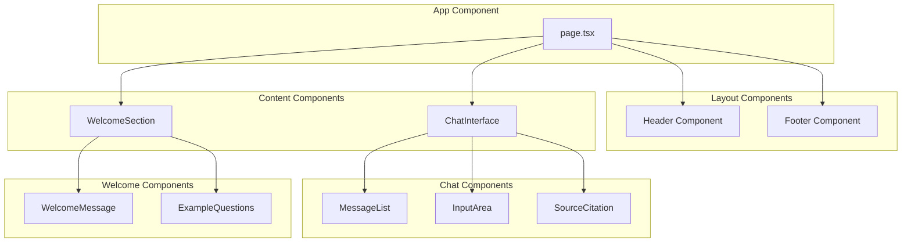

**Component Hierarchy**:

### 3.3 Key UI Features
- **Welcome Message**: Clear facts-only positioning
- **Example Questions**: 3 pre-defined factual queries
- **Chat Interface**: Clean, minimal design
- **Source Citations**: Prominent link display
- **Disclaimer Footer**: "Facts-only. No investment advice."

### 3.4 State Management
```typescript
interface ChatState {
  messages: Message[];
  isLoading: boolean;
  error: string | null;
}

interface Message {
  id: string;
  type: 'user' | 'assistant';
  content: string;
  source?: string;
  timestamp: Date;
}
```

## Phase 4: Integration and Testing

### 4.1 API Architecture
**Endpoints**:
```
POST /api/chat
- Input: { query: string }
- Output: { response: string, source: string, timestamp: string }

GET /api/health
- System health check

GET /api/sources
- List of official sources used
```

### 4.2 Error Handling
**Response Codes**:
- 200: Successful response
- 400: Invalid query format
- 422: Advisory query refusal
- 500: System error

**Error Response Format**:
```json
{
  "error": "This appears to be an advisory query. I can only provide factual information about mutual funds.",
  "educational_link": "https://www.amfiindia.com/investor-education"
}
```

### 4.3 Testing Strategy
**Unit Tests**:
- Query classification accuracy
- Response length validation
- Source citation verification
- Refusal message testing

**Integration Tests**:
- End-to-end query processing
- API response validation
- UI component testing
- Source link verification

**Performance Tests**:
- Response time (< 3 seconds)
- Concurrent user handling
- Vector search performance

## Phase 5: Security and Compliance

### 5.1 Data Privacy Measures
**No Collection of**:
- PAN/Aadhaar numbers
- Bank account details
- Contact information
- Personal investment data

**Implementation**:
- No user accounts or authentication
- No data persistence beyond session
- Anonymous usage analytics only

### 5.2 Content Compliance
**Automated Checks**:
- Response length monitoring
- Source link validation
- Advisory content detection
- Disclaimer inclusion verification

**Manual Review**:
- Sample response quality checks
- Source accuracy verification
- Compliance audit trails

### 5.3 Security Measures
- HTTPS enforcement
- API rate limiting
- Input sanitization
- XSS protection
- CSRF protection

## Phase 6: Deployment and Monitoring

### 6.1 Deployment Architecture

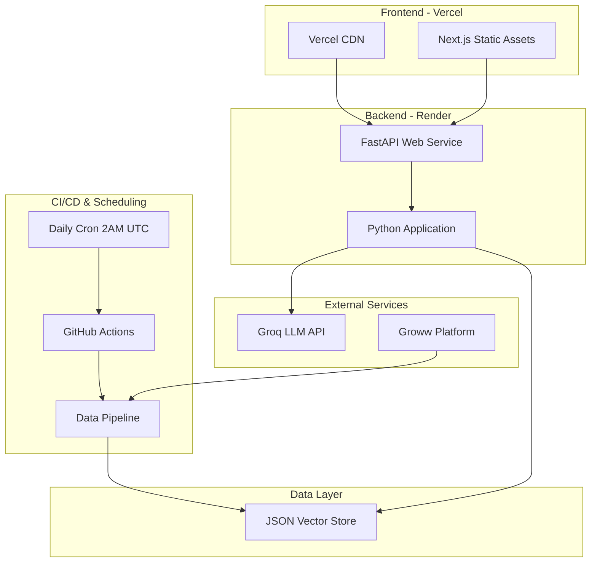

**Infrastructure Components**:
- **CI/CD & Scheduling**: GitHub Actions with daily cron jobs (2:00 AM UTC)
- **Frontend**: Next.js 14 hosted on Vercel
- **Backend**: FastAPI hosted on Render (Python Web Service)
- **Database**: Pure Python JSON vector store (`vector_store/store.json`)
- **LLM**: Groq API (Llama 3.1 8B Instant)

### 6.2 Monitoring and Analytics
**Metrics to Track**:
- Query volume and patterns
- Response accuracy (manual sampling)
- Source link click-through rates
- Error rates and types
- Performance metrics
- **Scheduler Metrics**:
  - Daily scraping success rates
  - Data freshness timestamps
  - Vector database update duration
  - Scraping error patterns

**Alerting**:
- High error rates
- Slow response times
- Source link failures
- System downtime
- **Scheduler Alerts**:
  - Daily scraping job failures
  - Data quality degradation
  - Vector database update failures
  - Scraping rate limit violations

### 6.3 Maintenance Procedures
**Daily**:
- Source link validation
- Error log monitoring
- Performance metrics review
- **Scheduler Tasks**:
  - Verify daily scraping job completion
  - Check data freshness timestamps
  - Monitor scraping success rates

**Weekly**:
- Content accuracy sampling
- User feedback review
- Source updates checking
- **Scheduler Tasks**:
  - Review scraping error patterns
  - Update scraping selectors if needed
  - Validate data quality metrics

**Monthly**:
- Vector database reindexing
- Model performance evaluation
- Compliance audit
- **Scheduler Tasks**:
  - Review and update GitHub Actions workflows
  - Optimize scraping performance
  - Update rate limiting and retry logic

## Technology Stack Summary

### Backend
- **Framework**: FastAPI (Python 3.11+)
- **RAG Pipeline**: Custom implementation (`ResponseGenerationPipeline`)
- **Vector DB**: Pure Python VectorStore (JSON persistence, cosine similarity)
- **Embeddings**: Hash-based bag-of-words vectorizer (384-dim, `_text_to_vector`)
- **LLM**: Groq (Llama 3.1 8B Instant)
- **Scraping**: BeautifulSoup4 + Selenium
- **Query Classification**: Regex-based policy guardrails (`classify_query_policy`)
- **Retrieval**: Metadata-aware reranking with lexical fallback

### Frontend
- **Framework**: Next.js 14 + TypeScript
- **Styling**: TailwindCSS
- **State**: TanStack React Query
- **HTTP Client**: Axios
- **Icons**: Lucide React
- **Deployment**: Vercel

### Infrastructure
- **Backend Hosting**: Render (Python Web Service)
- **Frontend Hosting**: Vercel (Next.js)
- **CI/CD**: GitHub Actions (daily scraping cron + manual dispatch)
- **Scheduling**: GitHub Actions Cron Jobs
- **Vector Store Backup**: GitHub Actions Artifacts

## Success Metrics

### Technical Metrics
- Response time < 3 seconds
- 99.5% uptime
- 95%+ query classification accuracy
- Zero data privacy incidents

### User Experience Metrics
- 90%+ factual accuracy (sampled)
- 100% source citation inclusion
- Proper refusal of advisory queries
- Clean, intuitive interface

### Compliance Metrics
- 100% disclaimer inclusion
- Zero investment advice provided
- All sources from official websites
- Regular compliance audits passed

## Risk Mitigation

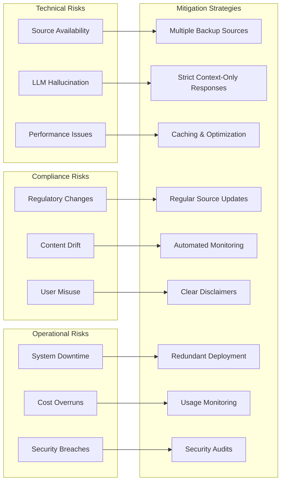

### Technical Risks
- **Source Availability**: Multiple backup sources
- **LLM Hallucination**: Strict context-only responses
- **Performance**: Caching and optimization

### Compliance Risks
- **Regulatory Changes**: Regular source updates
- **Content Drift**: Automated monitoring
- **User Misuse**: Clear disclaimers and refusals

### Operational Risks
- **Downtime**: Redundant deployment
- **Cost Management**: Usage monitoring and limits
- **Security**: Regular security audits

This architecture provides a robust, scalable, and compliant foundation for the Mutual Fund FAQ Assistant while maintaining strict adherence to the facts-only requirement and regulatory compliance.

## Development Workflow

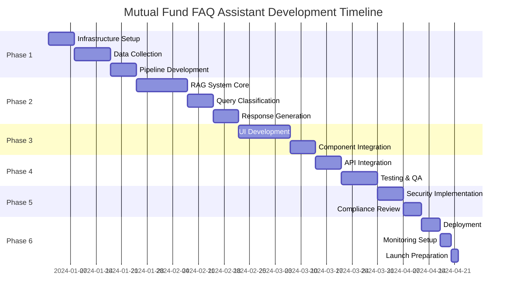
