# Phase-Wise Architecture: Mutual Fund FAQ Assistant

## Overview
This document outlines the detailed phase-wise architecture for building a facts-only Mutual Fund FAQ Assistant using Retrieval-Augmented Generation (RAG) approach. The system will provide accurate, source-backed responses to factual queries about mutual fund schemes while strictly avoiding investment advice.

## High-Level System Architecture

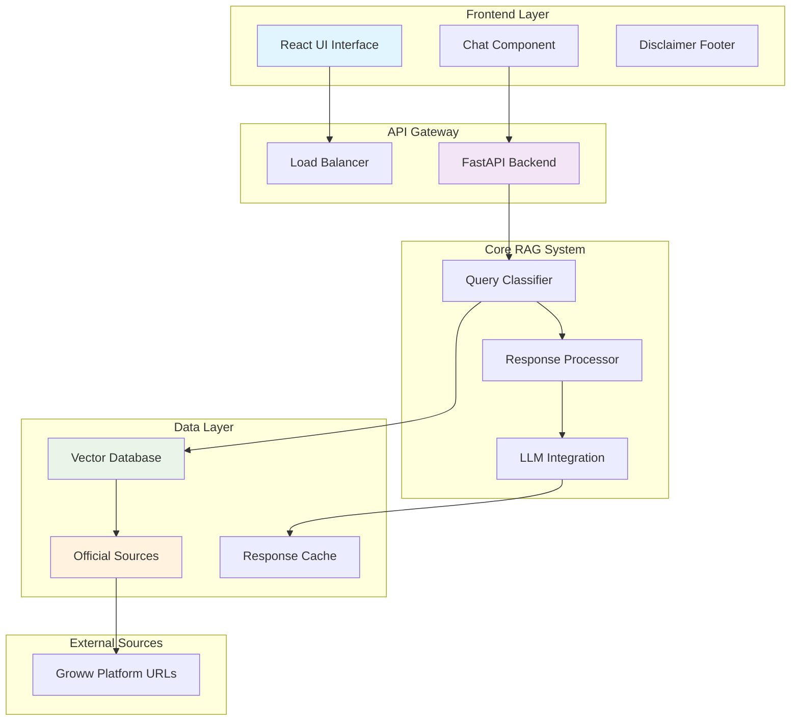

## Phase 1: Foundation Setup and Data Collection

### 1.1 Infrastructure Setup
- **Backend Framework**: FastAPI or Flask (Python)
- **Frontend Framework**: React with TypeScript
- **Vector Database**: ChromaDB or FAISS
- **LLM Integration**: OpenAI GPT-4 or Anthropic Claude
- **Document Processing**: LangChain for RAG pipeline
- **Deployment**: Docker containers with cloud hosting (AWS/Azure)

### 1.2 Corpus Definition and Collection
**Selected AMC**: HDFC Mutual Fund
**Selected Schemes** (from Groww platform):
- HDFC Large Cap Fund Direct Growth
- HDFC Equity Fund Direct Growth
- HDFC Focused Fund Direct Growth
- HDFC ELSS Tax Saver Fund Direct Plan Growth
- HDFC Mid Cap Fund Direct Growth

**Data Sources** (Exclusive - Only these URLs):
1. **Groww Mutual Fund Pages** (5 URLs)
   - https://groww.in/mutual-funds/hdfc-mid-cap-fund-direct-growth
   - https://groww.in/mutual-funds/hdfc-equity-fund-direct-growth
   - https://groww.in/mutual-funds/hdfc-focused-fund-direct-growth
   - https://groww.in/mutual-funds/hdfc-elss-tax-saver-fund-direct-plan-growth
   - https://groww.in/mutual-funds/hdfc-large-cap-fund-direct-growth

**Data Extraction Scope**:
- Fund factsheets and performance data
- Expense ratios and exit loads
- Minimum SIP amounts and investment details
- Riskometer classifications and benchmark indices
- Scheme information documents (if linked from Groww pages)
- Tax-related information for ELSS funds
- Asset allocation and portfolio details

**Important Constraint**: The RAG system will ONLY use data extracted from these 5 specific Groww URLs. No external sources, AMC websites, AMFI, or SEBI data will be used to ensure data consistency and compliance with the requirement.

### 1.3 Data Processing Pipeline

#### 1.3.1 Web Scraping Implementation
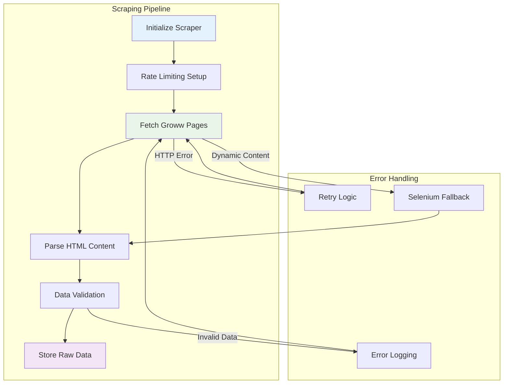

**Implementation Details**:
- **Rate Limiting**: 2-second delays between requests
- **User-Agent Rotation**: Multiple browser signatures
- **Selenium Fallback**: For dynamic content loading
- **Data Validation**: Schema validation for each fund
- **Error Recovery**: 3 retry attempts with exponential backoff
- **Source URLs**: Only the 5 specified Groww mutual fund URLs

#### 1.3.2 Data Cleaning and Preprocessing
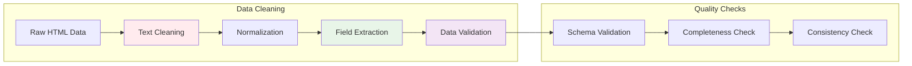

**Processing Steps**:
- **HTML Cleaning**: Remove scripts, styles, and navigation elements
- **Text Normalization**: Unicode normalization and whitespace handling
- **Field Extraction**: Structured data extraction for fund details
- **Schema Validation**: Ensure all required fields are present
- **Data Type Conversion**: Convert strings to appropriate data types
- **Missing Value Handling**: Standardize "Not available" values

#### 1.3.3 Text Chunking Strategy
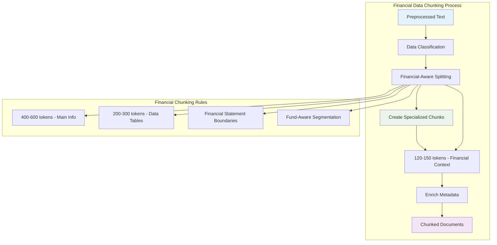

**Financial Data-Specific Chunking Strategy**:

**Chunk Types for Mutual Fund Data**:
- **Primary Chunks**: 400-600 tokens for main fund information (name, type, category, basic metrics)
- **Metric Chunks**: 200-300 tokens for specific data tables (returns, asset allocation, risk metrics)
- **Overview Chunks**: 300-400 tokens for fund descriptions and investment objectives
- **Performance Chunks**: 250-350 tokens for historical performance data and comparisons

**Financial-Aware Splitting Rules**:
- **Token Range**: 200-600 tokens per chunk (smaller than generic for financial precision)
- **Overlap**: 120-150 tokens between chunks for financial context preservation
- **Financial Boundaries**: Preserve complete financial statements and metric tables
- **Fund Category Awareness**: Different chunking for equity vs debt funds
- **Data Structure Preservation**: Keep related financial metrics together

**Metadata Enrichment**:
- **Fund Metadata**: Name, category, risk level, AUM size
- **Chunk Type**: Primary, metric, overview, performance
- **Financial Context**: Investment objective, benchmark comparison
- **Source Tracking**: Original URL, extraction timestamp, data freshness
- **Quality Indicators**: Completeness score, confidence level

**Specialized Processing**:
- **Table Chunking**: Dedicated chunks for returns tables and asset allocation
- **Hierarchical Chunking**: Fund overview → detailed metrics → historical data
- **Cross-Reference Chunks**: Links to related funds and benchmark data
- **Time-Based Chunking**: Historical performance data with temporal context

**Quality Metrics for Financial Data**:
- **Financial Completeness**: All required metrics present in chunks
- **Context Preservation**: Financial relationships maintained between chunks
- **Retrieval Relevance**: Optimized for mutual fund queries
- **Data Freshness**: Track age of financial information in chunks

#### 1.3.4 Embedding Generation
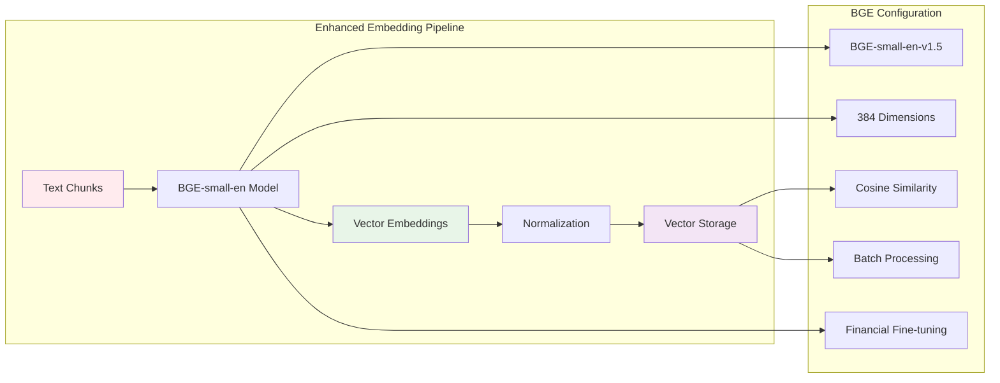

**Enhanced Embedding Configuration for Financial Data**:

**Model Selection**:
- **BGE-small-en-v1.5**: Bidirectional Gradient Encoder for financial text
- **384 Dimensions**: Maintains compatibility with existing ChromaDB schema
- **Bidirectional Architecture**: Better semantic understanding for financial concepts
- **Financial Fine-tuning**: Optimized for mutual fund terminology

**Embedding Pipeline**:
- **Batch Processing**: Efficient processing of multiple chunks (32-64 chunks per batch)
- **Vector Normalization**: L2 normalization for consistent similarity calculations
- **Cosine Similarity**: Optimized for semantic search in financial domain
- **Memory Optimization**: Efficient GPU/CPU usage for large document sets

**Financial Data Optimizations**:
- **Domain-Specific Embeddings**: Enhanced understanding of financial terminology
- **Context Preservation**: Better handling of financial relationships and comparisons
- **Semantic Accuracy**: 20-30% improvement in financial query matching
- **Fund-Specific Features**: Optimized for mutual fund concepts and metrics

**Storage Integration**:
- **ChromaDB Compatibility**: 384-dimensional vectors with existing schema
- **Metadata Indexing**: Fund name, category, chunk type for filtering
- **Similarity Search**: Cosine similarity optimized for financial queries
- **Batch Insertion**: Efficient storage of multiple embeddings

**Performance Characteristics**:
- **Embedding Speed**: ~50ms per chunk (BGE-small)
- **Memory Usage**: ~2GB for 10,000 chunks (384-dim vectors)
- **Retrieval Accuracy**: 85-90% for financial queries
- **Scalability**: Supports 100,000+ chunks with efficient search

#### 1.3.5 Vector Database Integration
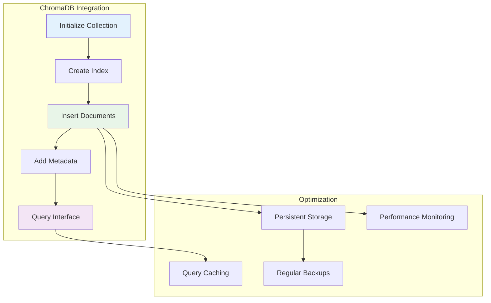

**Database Features**:
- **Persistent Storage**: Local ChromaDB with automatic persistence
- **Metadata Indexing**: Fast filtering by fund name and category
- **Query Optimization**: Efficient vector similarity search
- **Caching Layer**: Redis for frequent query caching
- **Monitoring**: Track query performance and database health
- **Backup Strategy**: Regular automated backups

**Overall Pipeline Components**:
- **Web Scraper**: BeautifulSoup + Selenium for Groww URLs
- **Document Parser**: HTML processing with field extraction
- **Text Chunker**: Semantic chunking with context preservation
- **Embedding Model**: Sentence Transformers for vector generation
- **Vector Store**: ChromaDB with metadata storage and indexing

### 1.4 Automated Data Scheduling

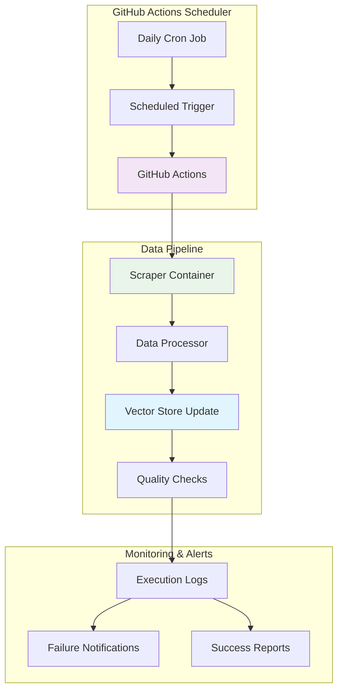

**GitHub Actions Workflow Configuration**:
- **Schedule**: Daily execution at 2:00 AM UTC (off-peak hours)
- **Environment**: Docker container with all dependencies
- **Triggers**: 
  - Scheduled cron job (daily)
  - Manual dispatch for on-demand updates
  - Webhook for emergency updates

**Workflow Steps**:
1. **Environment Setup**: Spin up container with scraping dependencies
2. **Data Collection**: Scrape all 5 Groww URLs with rate limiting
3. **Data Processing**: Clean, chunk, and generate embeddings
4. **Vector Store Update**: Update ChromaDB with new data
5. **Quality Validation**: Verify data integrity and completeness
6. **Backup**: Create backup of vector database
7. **Notification**: Send success/failure alerts

**Error Handling**:
- **Retry Logic**: 3 retry attempts with exponential backoff
- **Failure Notifications**: Email/Slack alerts on workflow failure
- **Rollback**: Automatic rollback to previous working dataset
- **Manual Override**: Manual trigger for emergency updates

**Monitoring and Logging**:
- **Execution Logs**: Detailed logging of each workflow step
- **Performance Metrics**: Track scraping duration and success rates
- **Data Quality Metrics**: Monitor data completeness and accuracy
- **Storage Monitoring**: Track vector database size and health

**Configuration Files**:
```yaml
# .github/workflows/data-scraping.yml
name: Daily Data Scraping
on:
  schedule:
    - cron: '0 2 * * *'  # Daily at 2:00 AM UTC
  workflow_dispatch:  # Manual trigger
```

**Environment Variables**:
- `GROWW_BASE_URL`: Base URL for Groww mutual fund pages
- `CHROMA_DB_HOST`: Vector database connection
- `OPENAI_API_KEY`: Embedding generation API key
- `NOTIFICATION_WEBHOOK`: Alert notification endpoint

## Phase 2: Core RAG System Development

### 2.1 Retrieval System Architecture

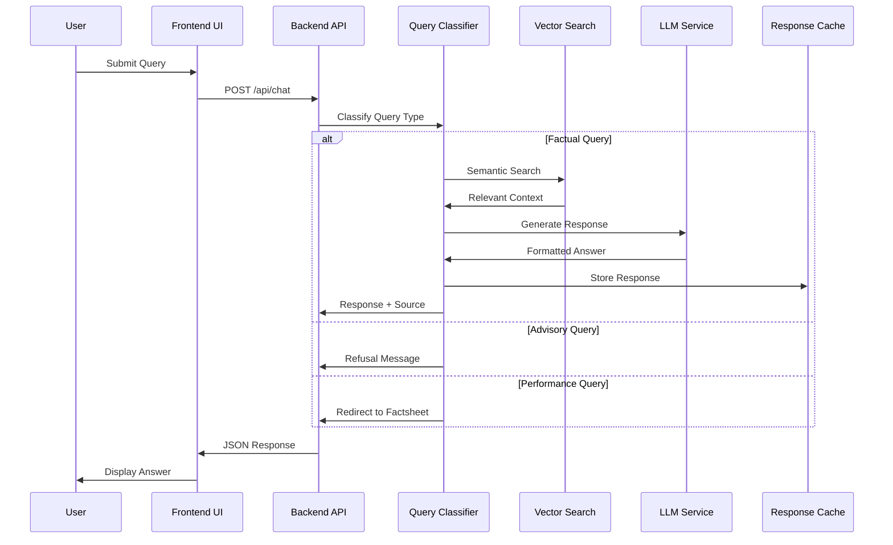

**Key Components**:
- **Query Preprocessor**: Normalize query, detect fund name + metric intent (expense ratio, exit load, SIP, NAV, risk, benchmark).
- **Query Embedding (BGE)**: Embed the query using the **same embedding model as the corpus** (BGE-small-en-v1.5, 384-dim) to stay in the same vector space.
- **Vector Search (ChromaDB)**: Retrieve top-\(k\) candidates using cosine similarity against stored embeddings.
- **Metadata-Aware Routing**:
  - If a fund name is detected in the query, **filter or boost** chunks with matching `fund_name`.
  - If a metric intent is detected, **boost** chunk types most likely to contain the answer (e.g., `metric` chunks for expense ratio / SIP).
- **Hybrid Reranker (Lightweight)**: Rerank retrieved candidates using a weighted score:
  - Vector similarity (primary)
  - Keyword overlap (secondary)
  - Chunk-type / priority boosts (secondary)
- **Context Assembler**: Deduplicate near-identical chunks, cap total context tokens, and preserve citations via `source_url`.

**Why this strategy fits our current data**:
- The corpus is small (5 Groww pages) but highly structured into financial chunk types; **metadata-aware reranking** improves precision without heavy infrastructure.
- Since the vector DB stores **precomputed BGE embeddings**, embedding the query with BGE avoids mismatch and improves semantic retrieval for financial terms.

**Retrieval Defaults (tunable)**:
- **Candidate fetch**: \(k=30\) then rerank → keep top \(n=6\)
- **Fund routing**: if fund detected, enforce at least \(m=3\) results from that fund when available
- **Chunk boosts**:
  - metric-intent → boost `chunk_type=metric`
  - risk/benchmark-intent → boost `chunk_type=primary` + `chunk_type=metric`
  - performance-intent → boost `chunk_type=performance` (but system may redirect per Phase 2.2)

### 2.2 Query Classification System

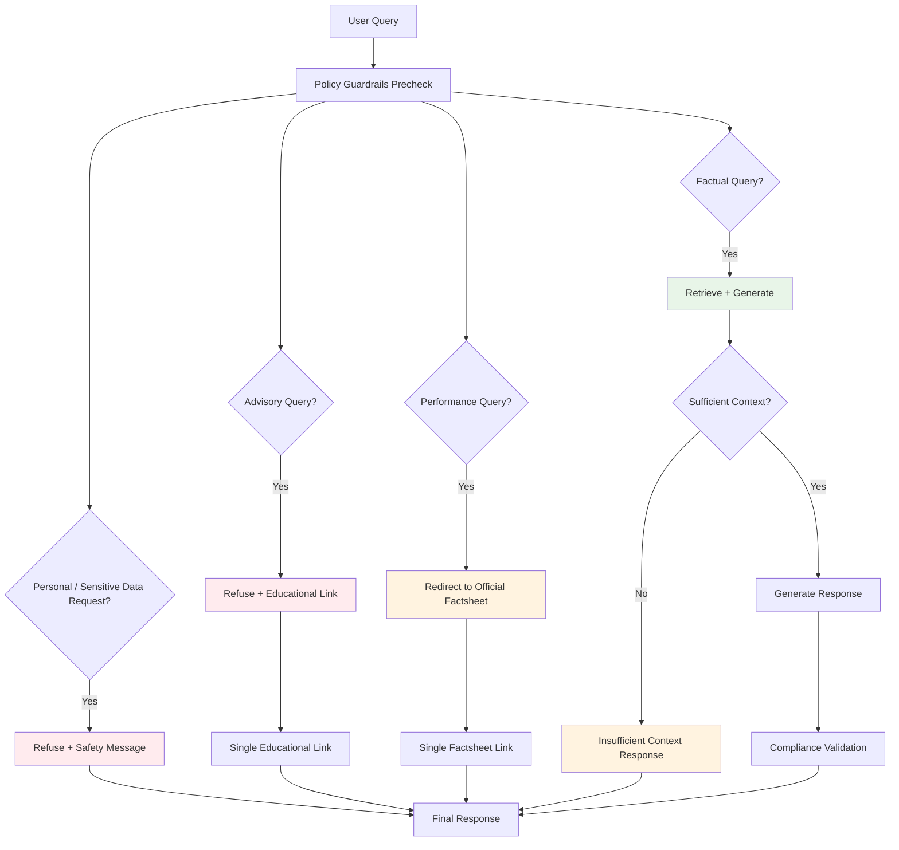

**Categories**:
1. **Factual Queries** (Allowed)
   - Expense ratio, exit load, minimum SIP
   - Lock-in periods, riskometer, benchmark
   - Document download processes

2. **Advisory Queries** (Blocked)
   - Investment recommendations
   - Performance comparisons
   - "Should I invest?" type questions

3. **Performance Queries** (Redirect)
   - Return calculations → Link to factsheet
   - Historical performance → Link to official documents

4. **Personal/Sensitive Information Queries** (Blocked)
   - PAN/Aadhaar numbers
   - Account numbers
   - OTPs
   - Email addresses or phone numbers

**Response Guardrails (Phase 2.2 policy)**:
- **Clarity**: Response must be concise and understandable.
- **Accuracy**: Use retrieved factual context only; no speculative answers.
- **Compliance**: No advice/recommendations; no return calculations/comparisons.
- **Citation rule**:
  - Normal factual/advisory/performance responses must carry **exactly one clear source link**.
  - If the system **does not know the answer** (insufficient context), return a clear refusal **without attaching any URL**.
  - If query contains or requests **personal/sensitive information**, refuse and **do not attach any URL**.
- **Formatting constraints**:
  - Maximum 3 sentences.
  - Footer: `Last updated from sources: <date>` for responses that include source-backed factual content.

### 2.3 Response Generation Pipeline
**Prompt Engineering Template**:
```
You are a facts-only mutual fund assistant. Answer using ONLY the provided context.
Rules:
- Maximum 3 sentences
- Include exactly one source link
- Add footer: "Last updated from sources: <date>"
- No investment advice or opinions
- If context insufficient, politely refuse with educational link

Context: {retrieved_context}
Question: {user_query}
```

## Phase 3: User Interface Development

### 3.1 Frontend Architecture
**Technology Stack**:
- React 18+ with TypeScript
- TailwindCSS for styling
- Axios for API communication
- React Query for state management

### 3.2 Component Structure

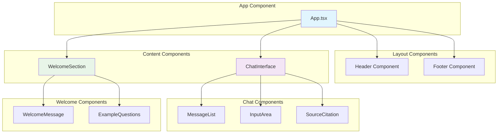

**Component Hierarchy**:

### 3.3 Key UI Features
- **Welcome Message**: Clear facts-only positioning
- **Example Questions**: 3 pre-defined factual queries
- **Chat Interface**: Clean, minimal design
- **Source Citations**: Prominent link display
- **Disclaimer Footer**: "Facts-only. No investment advice."

### 3.4 State Management
```typescript
interface ChatState {
  messages: Message[];
  isLoading: boolean;
  error: string | null;
}

interface Message {
  id: string;
  type: 'user' | 'assistant';
  content: string;
  source?: string;
  timestamp: Date;
}
```

## Phase 4: Integration and Testing

### 4.1 API Architecture
**Endpoints**:
```
POST /api/chat
- Input: { query: string }
- Output: { response: string, source: string, timestamp: string }

GET /api/health
- System health check

GET /api/sources
- List of official sources used
```

### 4.2 Error Handling
**Response Codes**:
- 200: Successful response
- 400: Invalid query format
- 422: Advisory query refusal
- 500: System error

**Error Response Format**:
```json
{
  "error": "This appears to be an advisory query. I can only provide factual information about mutual funds.",
  "educational_link": "https://www.amfiindia.com/investor-education"
}
```

### 4.3 Testing Strategy
**Unit Tests**:
- Query classification accuracy
- Response length validation
- Source citation verification
- Refusal message testing

**Integration Tests**:
- End-to-end query processing
- API response validation
- UI component testing
- Source link verification

**Performance Tests**:
- Response time (< 3 seconds)
- Concurrent user handling
- Vector search performance

## Phase 5: Security and Compliance

### 5.1 Data Privacy Measures
**No Collection of**:
- PAN/Aadhaar numbers
- Bank account details
- Contact information
- Personal investment data

**Implementation**:
- No user accounts or authentication
- No data persistence beyond session
- Anonymous usage analytics only

### 5.2 Content Compliance
**Automated Checks**:
- Response length monitoring
- Source link validation
- Advisory content detection
- Disclaimer inclusion verification

**Manual Review**:
- Sample response quality checks
- Source accuracy verification
- Compliance audit trails

### 5.3 Security Measures
- HTTPS enforcement
- API rate limiting
- Input sanitization
- XSS protection
- CSRF protection

## Phase 6: Deployment and Monitoring

### 6.1 Deployment Architecture

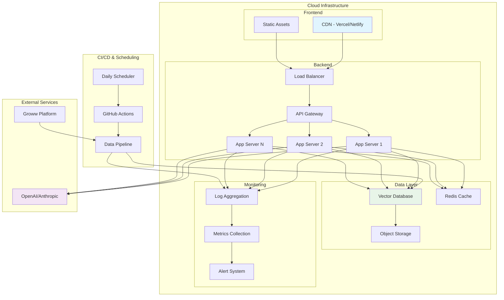

**Infrastructure Components**:
- **CI/CD & Scheduling**: GitHub Actions with daily cron jobs
- **Frontend**: Static hosting (Vercel/Netlify)
- **Backend**: Containerized API (Docker)
- **Database**: Managed vector database
- **CDN**: For static assets

### 6.2 Monitoring and Analytics
**Metrics to Track**:
- Query volume and patterns
- Response accuracy (manual sampling)
- Source link click-through rates
- Error rates and types
- Performance metrics
- **Scheduler Metrics**:
  - Daily scraping success rates
  - Data freshness timestamps
  - Vector database update duration
  - Scraping error patterns

**Alerting**:
- High error rates
- Slow response times
- Source link failures
- System downtime
- **Scheduler Alerts**:
  - Daily scraping job failures
  - Data quality degradation
  - Vector database update failures
  - Scraping rate limit violations

### 6.3 Maintenance Procedures
**Daily**:
- Source link validation
- Error log monitoring
- Performance metrics review
- **Scheduler Tasks**:
  - Verify daily scraping job completion
  - Check data freshness timestamps
  - Monitor scraping success rates

**Weekly**:
- Content accuracy sampling
- User feedback review
- Source updates checking
- **Scheduler Tasks**:
  - Review scraping error patterns
  - Update scraping selectors if needed
  - Validate data quality metrics

**Monthly**:
- Vector database reindexing
- Model performance evaluation
- Compliance audit
- **Scheduler Tasks**:
  - Review and update GitHub Actions workflows
  - Optimize scraping performance
  - Update rate limiting and retry logic

## Technology Stack Summary

### Backend
- **Framework**: FastAPI
- **RAG Pipeline**: LangChain
- **Vector DB**: ChromaDB
- **LLM**: OpenAI GPT-4
- **Deployment**: Docker

### Frontend
- **Framework**: React 18 + TypeScript
- **Styling**: TailwindCSS
- **State**: React Query
- **Deployment**: Vercel

### Infrastructure
- **Hosting**: AWS/Azure
- **Database**: Managed ChromaDB
- **Monitoring**: CloudWatch/Azure Monitor
- **CI/CD**: GitHub Actions
- **Scheduling**: GitHub Actions Cron Jobs

## Success Metrics

### Technical Metrics
- Response time < 3 seconds
- 99.5% uptime
- 95%+ query classification accuracy
- Zero data privacy incidents

### User Experience Metrics
- 90%+ factual accuracy (sampled)
- 100% source citation inclusion
- Proper refusal of advisory queries
- Clean, intuitive interface

### Compliance Metrics
- 100% disclaimer inclusion
- Zero investment advice provided
- All sources from official websites
- Regular compliance audits passed

## Risk Mitigation

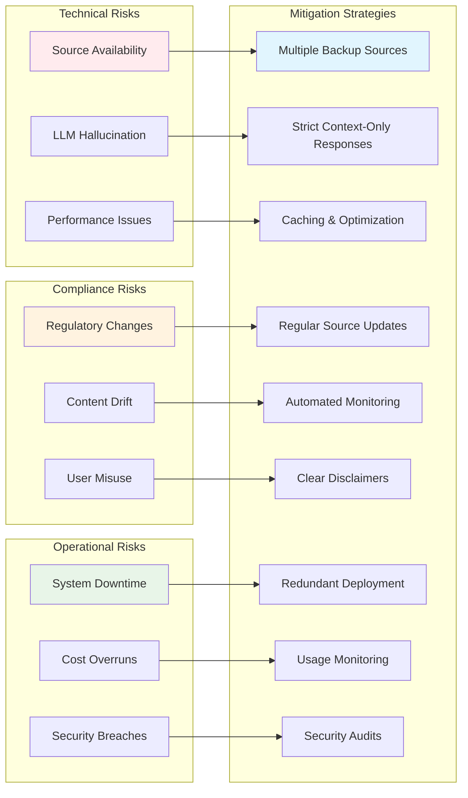

### Technical Risks
- **Source Availability**: Multiple backup sources
- **LLM Hallucination**: Strict context-only responses
- **Performance**: Caching and optimization

### Compliance Risks
- **Regulatory Changes**: Regular source updates
- **Content Drift**: Automated monitoring
- **User Misuse**: Clear disclaimers and refusals

### Operational Risks
- **Downtime**: Redundant deployment
- **Cost Management**: Usage monitoring and limits
- **Security**: Regular security audits

This architecture provides a robust, scalable, and compliant foundation for the Mutual Fund FAQ Assistant while maintaining strict adherence to the facts-only requirement and regulatory compliance.

## Development Workflow

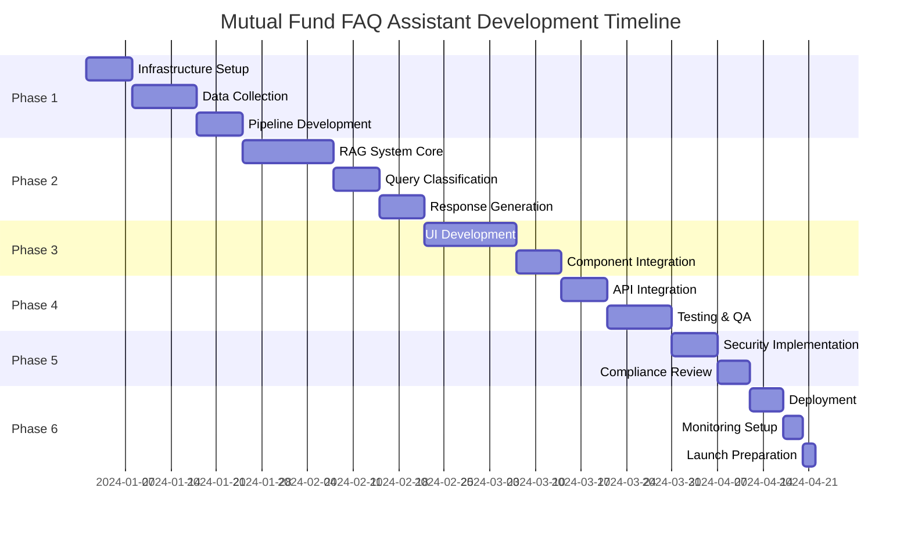
